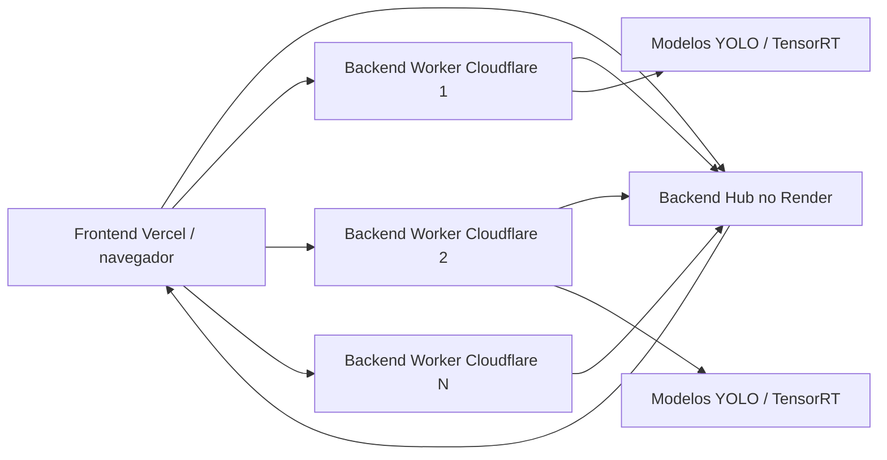

# Documentacao do projeto

## Nome

Vigilancia EPI.

## Objetivo

Desenvolver um sistema capaz de monitorar cameras em tempo real para identificar uso de EPIs, reconhecer funcionarios cadastrados, registrar status de risco e disponibilizar informacoes para integracao com empresas.

## Publico-alvo

Empresas com ambientes de risco, como construcao civil, industria, logistica, manutencao, oficinas e laboratorios tecnicos.

## Funcionalidades principais

- Cadastro e login de usuarios.
- Cadastro de EPIs.
- Upload de fotos para treinamento.
- Importacao de dataset anotado.
- Treinamento de modelos YOLO por EPI.
- Cadastro de funcionarios com fotos de rosto.
- Treinamento de modelo de reconhecimento de funcionarios.
- Monitoramento por webcam, video, tela ou dispositivo remoto.
- Alertas de EPI ausente.
- API de integracao para consultar deteccoes.
- Conversao TensorRT em backend NVIDIA.
- Hub central para varios backends.
- Escolha automatica do backend mais disponivel pelo frontend.

## Arquitetura resumida

## Tecnologias

- Python.
- Flask.
- OpenCV.
- Ultralytics YOLO.
- PyTorch.
- TensorRT, quando houver NVIDIA/CUDA.
- React via CDN no frontend.
- SQLite para usuarios.
- JSON para metadados de EPIs, funcionarios e modelos.
- Cloudflare Tunnel para expor backends locais.
- Render para o hub.
- Vercel para o frontend.

## Fluxo de uso

1. Usuario cria conta ou faz login.
2. Cadastra EPIs e funcionarios.
3. Envia fotos ou datasets.
4. Treina modelos customizados.
5. Inicia uma camera.
6. O backend processa frames e retorna status.
7. O painel exibe seguro/perigo, EPIs faltantes, funcionario identificado e FPS.
8. Empresas podem consultar os dados por API.

## Segurança e privacidade

Pontos considerados:
- autenticacao por token;
- dados por usuario em pastas separadas;
- camera remota com token proprio;
- endpoints publicos de integracao ainda exigem token;
- recomendacao de uso local para ambientes sensiveis.

Melhorias futuras:
- criptografia de tokens em banco;
- perfis de permissao;
- logs auditaveis;
- rotacao de chaves de API;
- armazenamento seguro das imagens.
