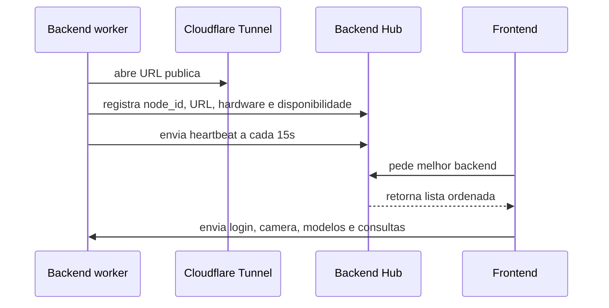

# Arquitetura multi-backend, TensorRT e API

## Visao geral

A nova arquitetura separa tres papeis:

- Frontend: interface do usuario, hospedada na Vercel ou aberta pelo Flask.
- Backend worker: servidor que processa camera e IA, podendo rodar em varias maquinas.
- Backend hub: servidor leve no Render que guarda os backends disponiveis.

## Fluxo multi-backend



## Criterios de escolha do backend

O hub ordena servidores considerando:
- disponibilidade informada pelo backend;
- ping medido no registro;
- quantidade de streams ativos;
- tipo de hardware;
- tempo desde o ultimo heartbeat.

## TensorRT

Quando o backend possui NVIDIA/CUDA:

1. O usuario envia um modelo `.pt` ou treina um modelo.
2. O backend inicia a conversao para `.engine`.
3. O modelo `.engine` fica ao lado do `.pt`.
4. Ao iniciar inferencia em NVIDIA, o `VideoProcessor` prefere `.engine`.
5. Se o `.engine` falhar, o sistema volta para `.pt`.

Endpoints:
- `GET /hardware`
- `GET /models/<modelo>/tensorrt`
- `POST /models/<modelo>/tensorrt`
- `POST /models/<modelo>/convert_tensorrt`

## API de integracao com empresas

Endpoints principais:

- `GET /api/v1/streams`
- `GET /api/v1/streams/<stream_id>/detections`
- `GET /api/v1/funcionarios`
- `GET /api/v1/epis`

Exemplo de resposta de deteccao:

```json
{
  "stream_id": "usuario_0",
  "employee_detected": true,
  "employees": [
    {"nome": "joao silva", "confidence": 0.86}
  ],
  "missing_epi": ["capacete"],
  "activity": "funcionario identificado em situacao de risco",
  "status": "perigo",
  "fps": 12.4,
  "runtime_backend": "tensorrt"
}
```

## Variaveis de ambiente

Backend worker:

```env
BACKEND_HUB_URL=https://seu-hub.onrender.com
PUBLIC_BACKEND_URL=
BACKEND_NODE_ID=backend-01
HUB_API_KEY=
EPI_USE_TENSORRT=1
```

Frontend:

```js
window.BACKEND_URL = "";
window.BACKEND_HUB_URL = "https://seu-hub.onrender.com";
```

Hub:

```env
HUB_API_KEY=
HUB_STALE_AFTER_SECONDS=45
HUB_PING_ON_HEARTBEAT=0
```

Arquivos de deploy incluidos:
- `backend/hub.py`: aplicacao Flask do hub.
- `requirements-hub.txt`: dependencias leves para o Render.
- `render-hub.yaml`: exemplo de configuracao do servico.
- `Procfile.hub`: comando alternativo para iniciar o hub.
