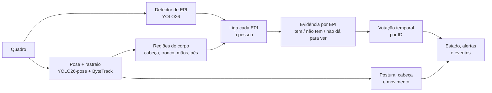
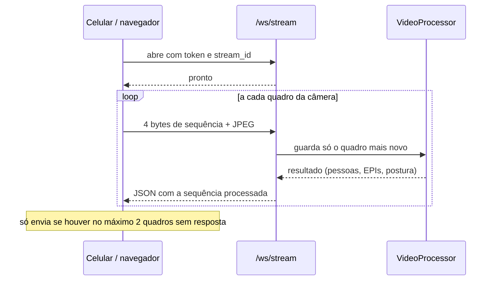

# Pose, modos de análise e dataset próprio (v19)

## O que mudou

| | Antes (v18) | Agora (v19) |
|---|---|---|
| Detecção | Um detector por quadro | Detector de EPI + modelo de pose (17 pontos do corpo) com rastreio |
| Regra de alerta | Faltava EPI se a classe não aparecia em lugar nenhum do quadro | Cada EPI é ligado à pessoa certa pela região do corpo |
| Estabilidade | Alerta piscava a cada quadro | Votação temporal por pessoa; alerta só depois de 2 s |
| Envio da câmera | JPEG em base64 dentro de JSON, 480 px, ~5 a 10 quadros/s | JPEG binário por WebSocket (HTTP como reserva), 15/30/60 fps com controle de fluxo |
| Vídeo exibido | Quadro anotado devolvido pelo servidor | Vídeo local fluido com o esqueleto desenhado por cima |
| Modos | Só tempo real | Tempo real, detalhado e super detalhado |
| Modelo de EPI | Treino com caixa de tela cheia (mAP 0) | Dataset unificado de 7 fontes, pseudo-rótulos e avaliação justa |

## Pipeline por quadro

Código: `backend/ppe_analyzer.py` (análise por pessoa), `backend/epi_detector.py` (detector e conversão de classes), `backend/ppe_taxonomy.py` (classes).

## EPI por pessoa

A região de cada EPI é calculada a partir dos pontos do corpo. A cabeça é ancorada nos **ombros**: de perfil o modelo de pose costuma errar nariz e olhos, e os ombros são bem mais estáveis.

| Região | EPIs | Como é calculada |
|---|---|---|
| Cabeça | capacete, óculos, máscara, protetor auricular, protetor facial | Acima da linha dos ombros, com folga para o capacete; refinada pelo rosto quando visível |
| Tronco | colete, vestimenta | Retângulo entre ombros e quadris |
| Mãos | luvas | Quadrado em cada punho, deslocado na direção do antebraço |
| Pés | calçado | Quadrado em cada tornozelo (ignorado se o pé está cortado na borda) |

Uma detecção pertence à pessoa cuja região contém a maior parte da caixa. Para cada EPI exigido a pessoa recebe uma evidência:

| Evidência | Peso | Quando |
|---|---:|---|
| `detectado` | +1,0 | Caixa do EPI na região |
| `ausencia_detectada` | −1,0 | Caixa da classe "sem" (ex.: `sem_capacete`) na região |
| `inferido` | −0,5 | Região visível, pessoa grande o bastante e nenhuma caixa |
| `nao_visivel` | 0 | Região fora do quadro ou pessoa pequena demais: não conta |

## Votação temporal

Janela de 1,5 s por pessoa e por EPI, com pelo menos 3 observações. Média ≥ 0,3 vira **ok**; média ≤ −0,35 vira **faltando**; entre os dois, o estado anterior é mantido. Isso evita que o alerta pisque. A violação vira **alerta** depois de 2 s seguidos em "faltando".

## Postura, cabeça e movimento

| Informação | Regra |
|---|---|
| Caído | Tronco (ombros → quadris) inclinado 60° ou mais; "possível queda" depois de 1,5 s |
| Curvado | Tronco entre 35° e 60° |
| Agachado | Joelho dobrado (< 110°) com a coxa quase horizontal |
| Braços levantados | Punho acima do nariz |
| Direção da cabeça | Nariz e olhos visíveis = de frente (ou virada, pela posição do nariz em relação aos ombros); só um lado do rosto = perfil; só ombros = de costas |
| Movimento | Velocidade do ponto dos pés em alturas de corpo por segundo: parado < 0,15; andando < 1,2; correndo acima disso |

## Modos de análise

| | Tempo real | Detalhado | Super detalhado |
|---|---|---|---|
| Onde roda | Ao vivo | Fila de análises no servidor | Fila de análises no servidor |
| Entrada | Quadros JPEG no ritmo que a rede e a GPU aguentam | Vídeo gravado (15/30/60 fps) enviado em partes enquanto grava | Igual ao detalhado |
| Pose | yolo26n-pose, 640 px | yolo26s-pose, 960 px | yolo26m-pose, 1280 px |
| Detector | 640 px | 960 px, todos os quadros | 1280 px + recortes ampliados de cada pessoa |
| Votação | Só passado | Só passado | Janela centrada (passado e futuro) |
| Saída | Estado ao vivo | Vídeo anotado, eventos, tempo sem EPI por pessoa | Tudo do detalhado + quadros duvidosos guardados para o dataset |

Código: `backend/analysis_jobs.py` (fila, processamento, revisão e vídeo de saída).

## Transporte em tempo real

O celular mostra o próprio vídeo a 30/60 fps e desenha o último resultado por cima. Quando a GPU ou a rede não dão conta, quadros deixam de ser enviados em vez de acumular atraso. Se o WebSocket não conecta (proxy, rede corporativa), o envio cai para `POST /stream_frame_bin` sem mudar nada na tela.

## API nova

| Método | Rota | Uso |
|---|---|---|
| WS | `/ws/stream?token=&stream_id=` | Tempo real por WebSocket |
| POST | `/stream_frame_bin` | Tempo real por HTTP (JPEG no corpo, cabeçalhos `X-Stream-Id` e `X-Frame-Seq`) |
| GET | `/analises` | Lista as análises do usuário |
| POST | `/analises` | Abre uma análise para receber gravação (`modo`: `detalhado` ou `super`) |
| PUT | `/analises/<id>/partes/<n>` | Envia uma parte da gravação |
| POST | `/analises/<id>/finalizar` | Junta as partes e coloca na fila |
| POST | `/analises/upload` | Envia um vídeo pronto |
| GET | `/analises/<id>` | Estado, progresso e resultado |
| GET | `/analises/<id>/arquivo/<arquivo>` | Vídeo anotado, miniaturas e quadros de revisão |
| DELETE | `/analises/<id>` | Cancela ou remove |

`GET /api/v1/streams/<id>/detections` passou a devolver também `persons` e `alerts`, e `missing_epi` agora usa as chaves da taxonomia (`capacete`, `luvas`...).

## Dataset e treinamento

Descritos em `treinamento/README.md`. Em resumo: 7 datasets públicos convertidos para 15 classes, limpeza de caixas, remoção de imagens repetidas entre fontes, divisão treino/validação/teste sem vazamento, modelo professor, pseudo-rótulos para os EPIs que cada fonte não anotou, modelo final e mAP justo por classe.

## Limitações

- O modelo de pose foi treinado com pessoas comuns (COCO). Com macacão largo, pessoas muito encolhidas ou câmeras de cima, os pontos erram mais.
- "Sem EPI inferido" exige a região visível e a pessoa com pelo menos 90 px de altura (160 px para mãos e pés). Pessoas menores ficam como "não visível", nunca como violação.
- A queda é uma regra de postura: alguém deitado de propósito também gera alerta.
- Protetor auricular, protetor facial e vestimenta têm poucos exemplos públicos. Espere desempenho menor nessas classes até somar vídeos próprios.
- O SH17 tem licença não comercial.
- A 60 fps, o envio pelo túnel Cloudflare depende do upload do celular. O controle de fluxo reduz os quadros enviados, mas a latência sobe em redes fracas.
